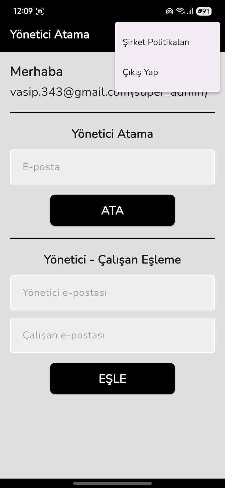
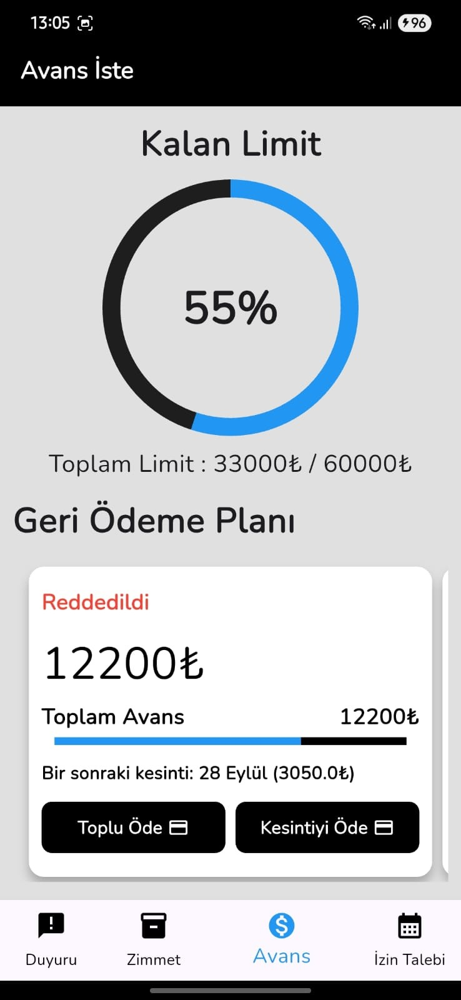
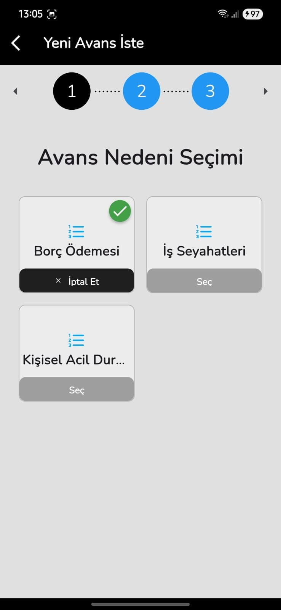
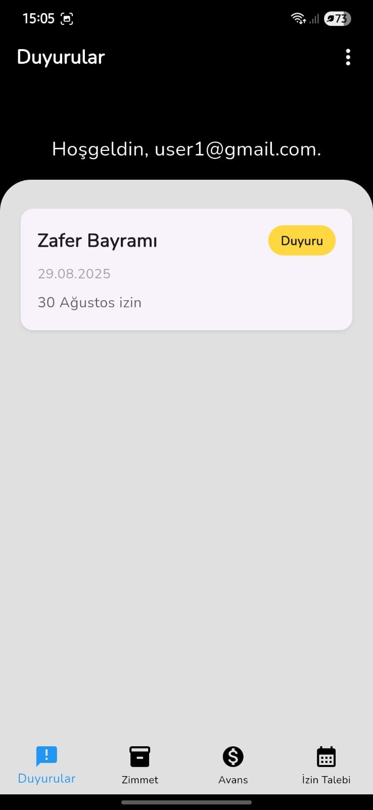
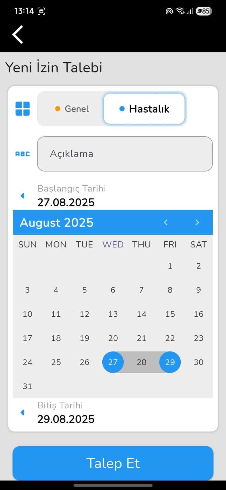
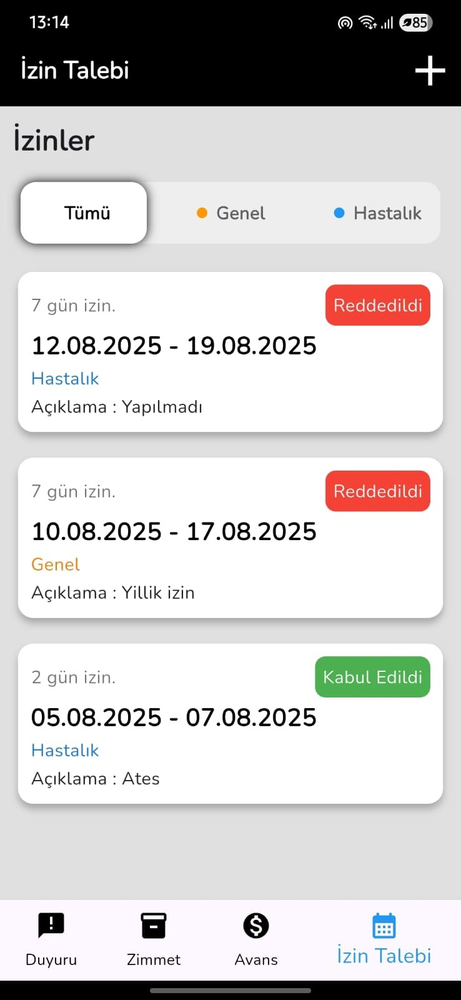
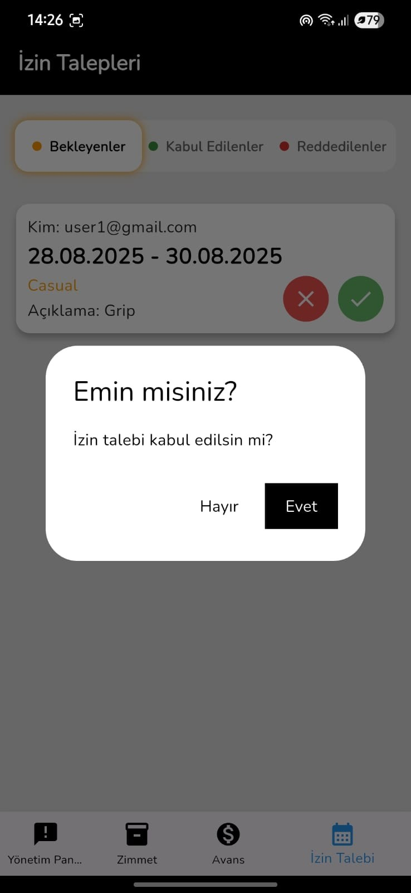
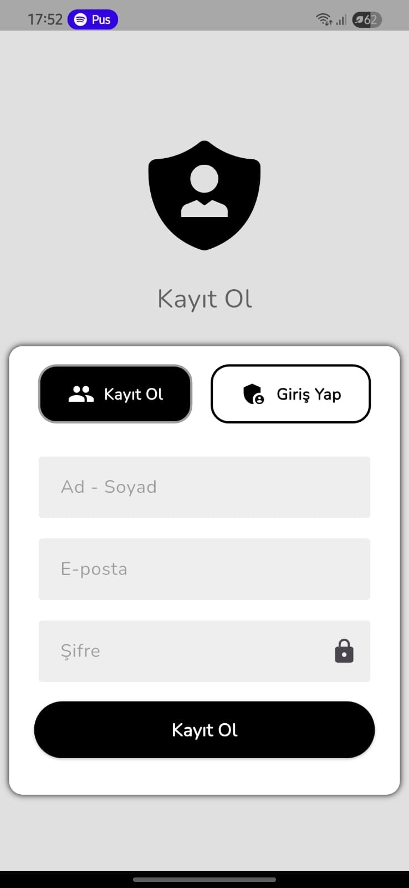
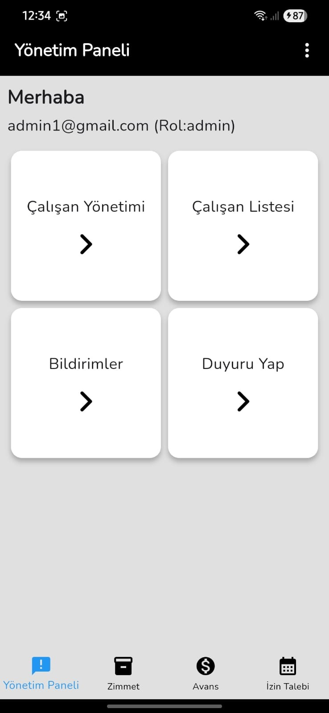
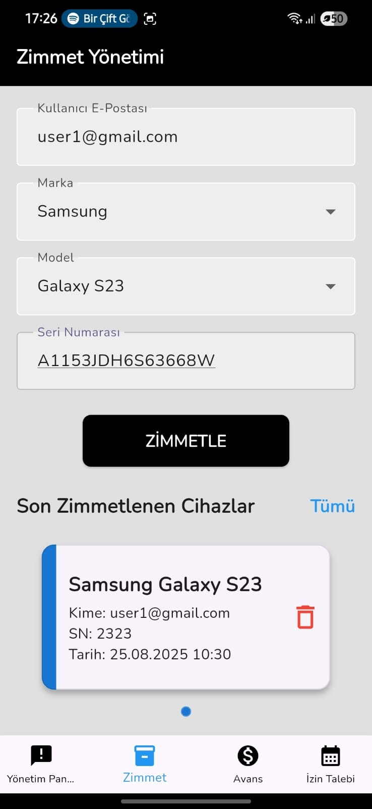

# İnsan Kaynakları Yönetim Uygulaması

Bu proje, staj çalışması kapsamında geliştirilmiş, Flutter ve Firebase tabanlı bir insan kaynakları  mobil uygulamasıdır. Uygulama, hem yönetici hem de çalışan rollerine yönelik özellikler sunarak temel İK süreçlerini dijitalleştirmeyi amaçlamaktadır.

## 📱 Ekran Görüntüleri

  
  
  
  
  
  
  
  
  
  

## ✨ Özellikler

Uygulama içerisinde şirket organizasyon yapısını dijital ortama yansıtmak amacıyla hiyerarşik bir yönetici-çalışan ilişkisi kurulmuştur. Her çalışanın, kendisine ait izin ve avans gibi taleplerini yöneten, kendisine doğrudan bağlı olduğu bir yöneticisi bulunmaktadır. Bu kritik atama işlemi, sistemdeki en üst yetkiye sahip olan “Süper Yönetici” rolündeki kullanıcı tarafından yapılır. Süper Yönetici, yönetim paneli üzerinden her bir çalışanı bağlı olacağı yönetici ile kolayca eşleştirerek, organizasyon şemasını sisteme tanımlar. Bu yapı sayesinde, bir çalışanın yaptığı tüm talepler doğrudan kendi yöneticisinin onayına düşer ve böylece iş akışları doğru ve verimli bir şekilde yönetilir.

Uygulama, kullanıcı rolüne göre farklı yetenekler sunar:

### **Yönetici Özellikleri**
- **Yönetici Paneli:** Tüm çalışanlara yönelik duyurular oluşturma ve yayınlama , şirket çalışanlarını listeleme, arama ve detaylarını görüntüleme.
- **Talep Yönetimi:** Çalışanlardan gelen izin ve avans taleplerini görüntüleme, onaylama veya reddetme.
- **Zimmet Yönetimi:** Çalışanlara zimmetlenen cihazları (laptop, telefon vb.) kaydetme ve yönetme.

### **Çalışan Özellikleri**
- **Duyuruları Görüntüleme:** Yöneticiler tarafından yapılan tüm duyuruları anlık olarak ana sayfada görme.
- **Talep Oluşturma:** İzin veya avans talebinde bulunma.
- **Talepleri Takip Etme:** Oluşturduğu taleplerin onay durumunu (Beklemede, Onaylandı, Reddedildi) takip etme.
- **Zimmet Bilgileri:** Kendi üzerine zimmetli cihazları görüntüleme.

## 🛠️ Kullanılan Teknolojiler ve Mimari

### **Teknoloji Seti (Tech Stack)**
- **Frontend:** Flutter & Dart
- **Backend & Veritabanı:** Firebase (Authentication, Firestore)
- **Durum Yönetimi (State Management):** BLoC (Business Logic Component)

### **Mimari (Architecture)**
Proje, kodun sürdürülebilir, test edilebilir ve ölçeklenebilir olması amacıyla **Clean Architecture (Temiz Mimari)** prensiplerine uygun olarak geliştirilmiştir. Katmanlar (Domain, Data, Presentation) arasındaki sorumluluklar net bir şekilde ayrılmıştır.

Durum yönetimi için tercih edilen **BLoC** deseni sayesinde, arayüz (UI) ve iş mantığı (business logic) birbirinden tamamen ayrılarak reaktif ve performanslı bir kullanıcı deneyimi hedeflenmiştir.

## 👤 İletişim

<İSMAİL VASİP>

- **LinkedIn:** [www.linkedin.com/in/ismail-vasip].
